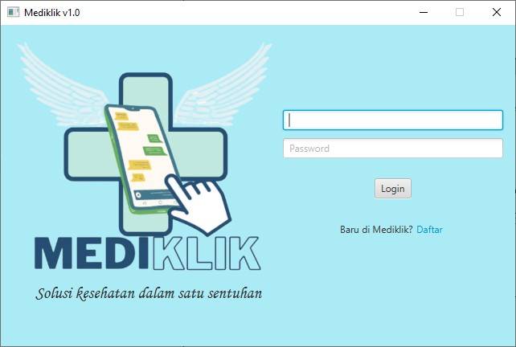

# Mediklik

## Tentang Mediklik
Mediklik adalah aplikasi e-commerce open-source untuk segala kebutuhan obat Anda. 

## Figma
Link = https://www.figma.com/proto/06YpdfD5tjPFn7ccZBoix2/Mediklik?node-id=178-598&scaling=contain&page-id=0%3A1&starting-point-node-id=178%3A598&t=knvZNfrwcjkcbnsw-1

### Fitur
* Penyaringan berdasarkan kategori
* User inteface yang sederhana
* Cross-platform

## Penggunaan
Download semua file dalam repository ini menggunakan `git`:
```
git clone https://github.com/raphael-lesmana/Mediklik.git
```

Lalu, install [JavaFX](https://openjfx.io/) dan [MariaDB](https://mariadb.org/) beserta [connectornya](https://mariadb.com/downloads/connectors/) (pastikan Anda memilih versi "Java").

Jalankan file `run.sql`:
```
mysql -u root -p < run.sql
```

Tambahkan library JavaFX dan MariaDB ke build path projek Java ini melalui IDE Java Anda, lalu Mediklik bisa dijalankan.
